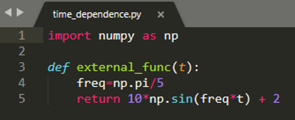
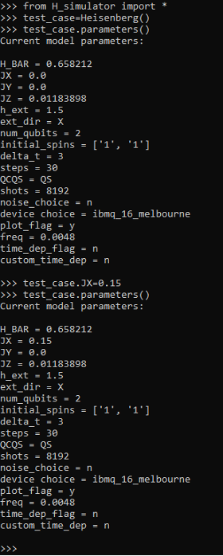

# Multiplatform Software for Time-dependent Quantum Simulations (MISTIQS)

## User’s Guide and Documentation

## I. System Requirements
This software requires the most recent version of: 
1. **Numpy** Numpy is used extensively to perform mathematical operations, manipulate arrays, and access mathematical libraries.

2. **Glob** Glob is used to enable the saving of data from multiple runs without overwriting text files

3. **Matplotlib** This is only needed if plotting is desired (see plot parameter), so it will only be imported if this parameter is set to **y**

## II.	Input file
The input file is flexible and keyword-based, so you can set as many of the available parameters as you want in any order.  The parameters available for customization are as follows:
1. **JX** : X-direction coupling coefficient
- Units: eV
- Default value: 0
2. **JY** : Y-direction coupling coefficient
- Units: eV
- Default value: 0
3. **JZ** : Z-direction coupling coefficient
- Units: eV
- Default value: 0
4. **h_ext** : External magnetic field coefficient
- Default value: 0
5. **ext_dir** : Controls direction of external magnetic field (X,Y, or Z)
- Default value: Z
6. **time_dep_flag** : Option to have a time-dependent external magnetic field coefficient
i)	Time dependence is implemented via a cosine term
- Available settings: **y** or **n** without the quotation marks
- Default value: n
7. **custom_time_dep** : This provides the option to define a custom time dependence function for the external field term (if time dependence is desired). 
If this is set to **n**, a standard cosine function will be implemented with the frequency chosen by the **freq** parameter (defined next in this documentation).
If this is set to **y**, a custom python function named **external func** must be defined in a python file named **time_dependence.py** It should only take in **t** as a parameter. 
- Default value: n
- An example is given below:

8. **freq** : If time_dep parameter is set to **y**, and a custom time dependence function is not specified, this controls the frequency of the cosine term driving the time dependence of the external field
- Units: 1/fs
- Default value: 0
9. **delta_t** : Simulation time step (must be a positive integer)
- Units: fs
- Default value: 1 
10. **steps** : Number of time steps to simulate (must be a positive integer)
- Default value: 1
11. **shots** : Number of shots to execute on the quantum device (must be a positive integer)
- Default value: 1024
12. **num_qubits** : Number of qubits (must be a positive integer)
-	Default value: 2
13. **initial_spins** Initial qubit spin vector
-	Qubit state |0> is mapped to spin 1, state |1> is mapped to spin -1
-	Enter vector as list of numbers (1 or -1) separated by commas with no spaces between (e.g. 1,1,1,-1,-1,-1 for a domain wall with 6 qubits)
-	Default value: 1,1
14. **QCQS**
-	Choice between running job on a quantum computer or a quantum simulator
-	Enter **QC** or **QS** without the quotation marks to choose the quantum computer or quantum simulator respectively
-	Default value: QS
15. **device** : Which IBM quantum device to run or emulate
i)	See the IBM Quantum Experience Dashboard to see a list of available devices
-	Default value: ibmq_rome
16. **noise_choice** : This presents the option to include simulated noise if running on a quantum simulator
-	Enter **y** or **n** without quotation marks
-	Default value: n
17. **plot_flag** : This presents the option to output individual plots of the average magnetization of each qubit over time (plots saved as image files)
-	Enter **y** or **n** without quotation marks
-	Default value: y
18. **compile** : Sets whether the generated quantum circuits are compiled
-	Default value: y
19. **default_compiler** : If **compile** is set to **y**, this controls what compiler is used (the compiler native to the quantum computing backend or a domain specific compiler)
-	Possible values: **native**, **ds**
-	Default value: native
20.	**auto_smart_compile** : Sets whether the software will automatically employ the domain-specific compilers when TFIM models are detected
-	Default value: y

To set a parameter, simply type ***parameter** on one line of the input file, then enter your selection for the parameter on the line below it. 
Comments are allowed on any line of the file except the line where the selection for a parameter is entered.

For example: If you’d like to set the number of shots to 2048 and change your IBMQ device to ibmq_16_melbourne, you would type:

***shots** #some comment here if desired
2048

#some arbitrary number of spaces between parameter set statements

***device**
Ibmq_16_melbourne

The order in which you set parameters does not matter.

**Note:** if you would like to change a parameter after creating a Heisenberg object, you can change it by simply setting ***object_name.param_name = new_value***. 
An example is shown below:

 

## III.	The Heisenberg Class and Methods
The Heisenberg class provides a container for everything you’ll need in this software. The only time a user would not create a Heisenberg object is if they only wanted to use the domain-specific compilers. In order for a Heisenberg object to be created, an input file must be passed to it. 
If you name the input file ***input_file.txt***, you do not need to pass any arguments to the Heisenberg class instantiation. After creating an instance of the Heisenberg class with a specific input file, you can use any of the following methods:

1.	**connect_IBM** If you want to generate or execute circuits on the IBM/Qiskit backend, this method needs to be run before any circuit generation or execution can occur. This connects your IBMQ account to the IBMQ backend, basically starting a session. 
If you’ve never used the IBMQ system before, you’ll have to call it with an API key found in your profile (example: object_name.connect_IBM(api_key=”API_KEY_HERE”). You only need to call this once within a python session, but there’s also no risks besides longer runtime associated with executing this method more often (such as in a script that is run multiple times).

2.	**parameters** Prints the current parameters of the Heisenberg object.

3.	**generate_circuits** Generates the quantum circuits to simulate the dynamics of the system described by the input file and translates them into the respective circuit objects of your backend of choice.
4.	**return_circuits** This will return any generated quantum circuits in a list.
5.	**run_circuits** Executes the generated quantum circuits on the quantum device specified in the input file and post-processes the results for average magnetization of each spin in the chain.